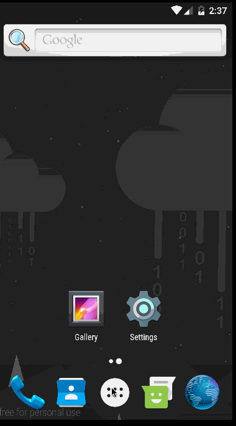

#Information
My Tasks - Application that allows to manage a basic todo list 

#Features
* Local persistence of Tasks in **Sqlite**
* Create/Read/Update/Delete actions for tasks
* Easy ORM Realm used for persistence

#Demo

    

